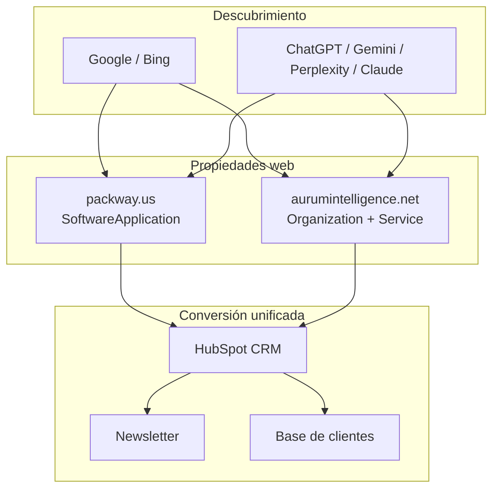

# Propuesta de optimización SEO + GEO
## Ecosistema BBI · Packway · Aurum Intelligence

| | |
|---|---|
| **Consultor** | Ing. Jesús Barros |
| **Fecha** | 10 de junio de 2026 |
| **Versión** | 1.0 |
| **Clasificación** | Confidencial — documento comercial |
| **Sitios incluidos** | [aurumintelligence.net](https://www.aurumintelligence.net/) · [packway.us](https://packway.us/) |

**Documentos base:**
- [Auditoría Aurum Intelligence](./clientes/aurum-intelligence/auditorias/2026-06-10-seo-geo-inicial.md)
- [Auditoría Packway](./clientes/packway/auditorias/2026-06-10-seo-geo-inicial.md)

---

## 1. Resumen ejecutivo

El cliente opera un **ecosistema B2B** en el sector packaging con dos webs complementarias:

| Sitio | Rol | Stack | Problema principal |
|-------|-----|-------|-------------------|
| **aurumintelligence.net** | Consultoría digital / AI para converters | WordPress + Elementor | Malware, 0 indexación, marca contaminada |
| **packway.us** | Landing del producto Packway Pre-Sales Suite | Next.js en Azure | www → Azure, sin SEO técnico, dominio no indexado |

Además del ecosistema web, el cliente ya dispone de **newsletter activa**, **HubSpot como CRM** y una **base de datos de clientes**. El cuello de botella no es la capacidad comercial: es que **ninguna de las dos webs genera leads orgánicos** de forma medible.

Esta propuesta define un programa integrado para **optimizar, implementar y documentar una estrategia SEO + GEO** en ambas propiedades, con entregables que permitan al equipo **ejecutar el plan de forma autónoma** tras el proyecto inicial.

**Objetivo medible:**

```
Búsqueda (Google / Bing / LLMs) → Web correcta → Lead en HubSpot → Oportunidad
         ↑                              ↑
    packway.us                    aurumintelligence.net
    (producto)                    (consultoría / partner)
```

---

## 2. Diagnóstico consolidado

### Activos que ya funcionan

| Activo | Aplicación en el ecosistema |
|--------|----------------------------|
| Newsletter | Nutrir audiencia packaging; empujar tráfico a landings nuevas |
| HubSpot | Unificar leads de ambas webs con UTMs y atribución por sitio |
| Base de clientes | Casos de éxito, referrals, reactivación post-optimización |
| Contenido Packway | Copy sólido de producto (estimating, Docupoint, API) |
| Blog Aurum | Artículos técnicos AI + packaging (diferenciador consultivo) |
| BBI International | Autoridad de producto indexada — referencia para schema `isPartOf` |

### Bloqueos actuales por sitio

**aurumintelligence.net**

| Bloqueo | Impacto |
|---------|---------|
| Inyección JS maliciosa | Riesgo de penalización y pérdida de confianza B2B |
| `site:aurumintelligence.net` = 0 | Cero tráfico orgánico consultivo |
| Posible penalización manual en GSC | Si existe, bloquea re-indexación incluso post-limpieza de malware |
| Restos theme Tecnologia + llms.txt contaminado | LLMs describen a Aurum como empresa IT genérica |
| Sin autoría ni E-E-A-T en blog | Artículos anónimos — baja ponderación por LLMs y Google Quality Raters |
| Formularios sin trazabilidad HubSpot clara | No se mide qué contenido genera pipeline |

**packway.us**

| Bloqueo | Impacto |
|---------|---------|
| `www.packway.us` redirige a Azure | Autoridad de dominio diluida; URL técnica indexada |
| Sin robots, sitemap, canonical, schema, OG | Crawlers y LLMs sin señales estructuradas |
| Riesgo de renderizado CSR en lugar de SSG | Si el HTML no pre-renderiza contenido, Google ve página vacía — requiere verificación antes de solicitar indexación |
| Sin Privacy Policy (CCPA + GDPR) | Fricción legal con prospects EU; bloquea presencia en G2/Capterra |
| Confusión de entidad "Packway" | ERP BBI vs PSS vs maquinaria PWI (packway.com) |
| SPA de una sola URL | Sin landings por módulo para captar intención comercial |

### Benchmark GEO (resumen)

Las auditorías individuales incluyen pruebas multi-modelo (ChatGPT, Gemini, Perplexity, Claude, Copilot, Google AI). Hallazgo común:

- **Packway PSS** aparece citando la URL de **Azure**, no `packway.us`.
- **Aurum** es parcialmente reconocible en contenido, pero con **datos incorrectos** (IT managed services, contactos del theme Tecnologia).
- Motores con búsqueda web (Perplexity, Google AI) rinden mejor que chat puro sin browsing para datos actuales.

---

## 3. Enfoque del servicio

### Principio: dos sitios, una estrategia, entidades diferenciadas



**Reglas de arquitectura de entidad (GEO):**

1. **Packway Pre-Sales Suite** = producto software de BBI International (`SoftwareApplication`).
2. **Packway ERP** = suite distinta en bbinternational.com — no mezclar en copy ni schema.
3. **Aurum Intelligence** = partner/consultoría (`Organization`), no desarrollador del producto.
4. URL Azure = solo infraestructura; **nunca** URL canónica ni citación en llms.txt.

---

## 4. Alcance por fases (ambas webs)

### Fase 1 — Fundación técnica (semanas 1–3)

| Entregable | packway.us | aurumintelligence.net |
|------------|------------|------------------------|
| Verificación renderizado SSG | `view-source:packway.us` confirma HTML pre-renderizado; si falla = bloqueante antes de GSC | N/A |
| Verificación Manual Actions GSC | N/A | GSC → Security & Manual Actions — penalización activa bloquea re-indexación post-limpieza |
| Corrección redirects / canonical | www → packway.us; bloquear indexación Azure | Confirmar www → www; fix non-www 500 |
| robots.txt + sitemap.xml | Archivos estáticos en `public/` | Validar existente; fix non-www |
| Google Search Console | Verificar packway.us | Verificar www |
| Seguridad | Revisión formulario JS | **Limpieza malware** + hardening WP |
| Tracking HubSpot + GA4 | Spec + eventos `generate_lead` | Spec + eventos + UTMs por sitio |
| Limpieza de marca | Quitar placeholders; fix enlace Aurum .com→.net | Eliminar Tecnologia / Clutch / footer Inactive |

**Resultado:** Ambos sitios seguros, indexables y medibles.

---

### Fase 2 — Arquitectura de conversión (semanas 4–8)

| Entregable | packway.us | aurumintelligence.net |
|------------|------------|------------------------|
| Mapa keywords | Software / pre-sales / estimating | Consultoría AI / demand planning / automation |
| Landing pages | `/estimating/`, `/docupoint/`, `/integration/` (o equivalente) | `/solutions/[servicio]/` (3–5 páginas) |
| Schema | SoftwareApplication + FAQPage | Service + Organization + FAQPage |
| Open Graph + social | Imagen 1200×630, Twitter Cards | Revisar OG homepage (og:type website) |
| Lead magnet | "Pre-Sales Automation Checklist" (PDF) | "AI Readiness Checklist for Converters" (PDF) |
| CTAs | Inline en secciones + formulario HubSpot | Bloque Elementor para blog + homepage |

**Resultado:** Cada intención comercial tiene URL propia y punto de conversión.

---

### Fase 3 — GEO y visibilidad en IA (semanas 6–10)

| Entregable | packway.us | aurumintelligence.net |
|------------|------------|------------------------|
| llms.txt | Definición PSS + módulos + URLs oficiales | Bloque entidad + exclusión templates Elementor |
| JSON-LD ampliado | Organization (BBI), SoftwareApplication, WebSite | Organization, Service, LocalBusiness, Article |
| Diferenciación entidades | Nota explícita PSS ≠ ERP ≠ packway.com | Aurum ≠ Tecnologia; partner de BBI |
| Benchmark re-test | Repetir prompts multi-modelo (sección en auditorías) | Idem |
| Guía GEO operativa | Cómo escribir/citar sin confundir marcas | Idem |

**Resultado:** Respuestas de LLMs alineadas con la realidad del negocio.

---

### Fase 4 — Estrategia autogestionable (semanas 10–12)

| Entregable | Descripción |
|------------|-------------|
| **Playbook SEO + GEO unificado** | Rutinas mensual/trimestral para ambos sitios |
| **Calendario editorial 90 días** | Contenido cruzado: blog Aurum ↔ anuncios Packway en newsletter |
| **Dashboard HubSpot** | Leads por sitio, landing, fuente orgánica/LLM referral |
| **Matriz de entidades** | Quién es quién (BBI, PSS, Aurum, partners) — referencia interna |
| **Checklist QA mensual** | 25 puntos aplicables a WP y Next.js |
| **Sesión de transferencia** | Walkthrough 2 h con equipo comercial y marketing |

**Resultado:** El cliente opera sin dependencia continua del consultor.

---

## 5. Integración marketing (compartida)

### HubSpot — un solo CRM, dos fuentes

| Campo / regla | Configuración |
|---------------|---------------|
| `lead_source` | `packway.us` \| `aurumintelligence.net` |
| UTMs estándar | `utm_source`, `utm_medium`, `utm_campaign`, `utm_content` |
| Workflows | Nuevo lead → owner < 24 h; lead magnet → secuencia 3 emails |
| Listas | Por industria (corrugated, flexo, folding carton) y por sitio de origen |

### Newsletter — orquestación de contenido

| Frecuencia | Acción |
|------------|--------|
| Mensual | 1 artículo Aurum resumido + CTA consultoría |
| Mensual (alterno) | Novedad Packway (módulo, caso, demo) + CTA demo |
| Al lanzar landing | Email dedicado con UTM a la URL nueva |
| Trimestral | Benchmark GEO interno: ¿cómo nos describen los LLMs? |

### Base de clientes

- **Packway:** logos en `/customers` → páginas de caso con permiso.
- **Aurum:** sustituir testimonios Tecnologia por 3–5 casos reales.
- **Campaña reactivación:** cuando Fase 2 cierre — email segmentado por producto vs consultoría.

---

## 6. Playbook resumido (entrega Fase 4)

### Rutina mensual (~4 h total)

| Semana | packway.us | aurumintelligence.net | HubSpot / newsletter |
|--------|------------|------------------------|----------------------|
| 1 | Revisar GSC errores | Revisar GSC cobertura | Dashboard leads por sitio |
| 2 | — | Publicar 1 artículo blog | Newsletter con extracto |
| 3 | Actualizar 1 FAQ o módulo | Revisar CTAs en posts recientes | Verificar workflows |
| 4 | Spot-check 3 prompts GEO | Spot-check 3 prompts GEO | Informe mensual 1 página |

### Rutina trimestral (1 día)

1. Re-test benchmark multi-modelo (plantilla en auditorías).
2. Actualizar llms.txt en ambos sitios si cambió messaging.
3. Revisar 10 keywords núcleo por sitio.
4. Auditoría técnica ligera (canonical, schema, formularios, velocidad).
5. Alinear contenido BBI ↔ Packway ↔ Aurum (sin duplicar ni contradecir).

### KPIs orientativos (6 meses)

| Métrica | packway.us | aurumintelligence.net |
|---------|------------|------------------------|
| Páginas indexadas | 5+ (home + módulos + legal) | 20+ |
| Sesiones orgánicas/mes | Crecimiento sostenido | Crecimiento sostenido |
| Leads orgánicos/mes | Baseline mes 2 | Baseline mes 2 |
| Conversión web → lead | 2–4% (producto) | 1,5–3% (consultoría) |
| Precisión benchmark GEO | ≥80% respuestas correctas | ≥80% respuestas correctas |

---

## 7. Calendario 90 días (ecosistema)

| Mes | packway.us | aurumintelligence.net | Newsletter |
|-----|------------|------------------------|------------|
| 1 | Fix técnico + GSC + llms.txt borrador | Seguridad + limpieza Tecnologia + GSC | Anuncio: "sitios en optimización" |
| 1 | Lead magnet PSS checklist | Lead magnet AI checklist | Email descarga por segmento |
| 2 | Launch `/estimating/` | Launch `/solutions/pre-sales-automation/` | Caso: quoting más rápido |
| 2 | Schema SoftwareApplication live | 1 artículo blog + CTA | Resumen artículo Aurum |
| 3 | Launch `/docupoint/` | Launch `/solutions/demand-planning/` | Demo Packway + consultoría Aurum |
| 3 | Benchmark GEO re-test | FAQ schema + benchmark re-test | Informe trimestral interno |

---

## 8. Qué incluye y qué no incluye

### Incluye

- Auditorías iniciales de ambos sitios (realizadas — Ing. Jesús Barros)
- Plan de acción priorizado por sitio y fase
- Especificaciones técnicas (robots, sitemap, schema, llms.txt, HubSpot, GA4)
- Playbook unificado y calendario editorial 90 días
- Plantilla de benchmark GEO multi-modelo
- Sesión de transferencia al equipo

### No incluye (coordinable aparte)

- Implementación en código (Next.js / WordPress / Elementor / Azure)
- Limpieza de malware en servidor (se guía; ejecución del hosting)
- Redacción mensual continua post-proyecto
- Gestión diaria de HubSpot o envío de newsletters
- Link building activo
- Desarrollo de nuevas features en Packway PSS

---

## 9. Inversión recomendada

### 9.1 Honorarios del consultor

| Fase | Semanas | Honorarios |
|------|---------|------------|
| Fase 1 — Fundación técnica (2 sitios) | 1–3 | $2,500 USD |
| Fase 2 — Arquitectura de conversión | 4–8 | $3,000 USD |
| Fase 3 — GEO y visibilidad en IA | 6–10 | $2,500 USD |
| Fase 4 — Playbook y transferencia | 10–12 | $1,500 USD |
| **Total proyecto (12 semanas)** | | **$9,500 USD** |

**Términos de pago:** 50 % al inicio · 25 % al cierre de Fase 2 · 25 % al cierre de Fase 4.

> Opción modular: Fases 1 + 2 solamente (fundación técnica + arquitectura de conversión): **$5,500 USD**.

### 9.2 Retainer post-proyecto (opcional)

Servicio mensual una vez finalizado el programa inicial:

| Servicio | Frecuencia | Precio |
|----------|-----------|--------|
| Revisión GSC + benchmarks GEO | Mensual | |
| Revisión de 1 artículo/landing nueva | Mensual | |
| Spot-check técnico (canonical, schema, formularios) | Mensual | |
| Informe mensual de 1 página (sesiones → leads → oportunidades) | Mensual | |
| **Total retainer mensual** | | **$1,500 USD/mes** |

---

## 10. Herramientas y costos de plataforma

Los siguientes costos son de **terceros** — no incluidos en los honorarios del consultor. El cliente los contrata directamente con cada proveedor.

### 10.1 Urgentes — Aurum Intelligence (WordPress)

| Herramienta | Para qué | Costo estimado | Prioridad |
|-------------|----------|----------------|-----------|
| **Sucuri Security** o **Wordfence Premium** | Limpieza de malware + firewall WordPress | $99–$229/año | 🔴 Inmediato |
| **All in One SEO Pro** | Schema avanzado, llms.txt, sitemaps — verificar si ya tienen versión pagada | $99–$299/año | 🟠 Corto plazo |
| **WP Rocket** | Core Web Vitals, caché, compresión CSS/JS | $59/año | 🟠 Corto plazo |
| **ShortPixel** o **Imagify** | Optimización de imágenes (WebP, compresión) | $9.99–$12/mes | 🟡 Medio plazo |

### 10.2 Seguimiento SEO (compartido ambos sitios)

| Herramienta | Para qué | Costo estimado | Notas |
|-------------|----------|----------------|-------|
| **SEMrush Pro** o **Ahrefs Lite** | Backlinks, keyword tracking, auditoría técnica continua | $99–$129/mes | Recomendado mínimo 3 meses durante el proyecto ($300–$390) |
| **Screaming Frog SEO Spider** | Crawl técnico completo, errores 404, redirects | $259/año | Herramienta del consultor — no requiere compra del cliente |
| **Google Search Console** | Indexación, cobertura, CWV, manual actions | **Gratis** | Requiere verificación de propiedad |
| **Google Analytics 4** | Tráfico, conversiones, sesiones orgánicas | **Gratis** | Ya instalado; verificar configuración de eventos |
| **PageSpeed Insights** | Core Web Vitals mobile + desktop | **Gratis** | — |

### 10.3 Compliance legal — Packway

| Herramienta | Para qué | Costo estimado | Notas |
|-------------|----------|----------------|-------|
| **Termly** o **iubenda** | Privacy Policy CCPA + GDPR, banner de cookies | $0–$29/mes | Versión gratuita suficiente para MVP; paid si necesitan personalización avanzada |

### 10.4 CRM y marketing (activos existentes — verificar plan)

| Herramienta | Estado | Costo estimado |
|-------------|--------|----------------|
| **HubSpot** | Ya activo | Verificar si el plan actual incluye formularios con tracking UTM y listas segmentadas; Marketing Starter desde $15/mes |
| **Newsletter** | Ya activa | Sin costo adicional estimado |
| **Wikidata** | Crear entradas para ambas entidades | **Gratis** |

### 10.5 Resumen presupuesto de herramientas

| Categoría | Costo estimado durante el proyecto (3 meses) |
|-----------|----------------------------------------------|
| Seguridad WordPress (Aurum) | $100–$230 |
| Rendimiento WordPress (Aurum) | $60–$180 |
| SEO tracking (compartido) | $300–$390 |
| Compliance legal (Packway) | $0–$90 |
| **Total herramientas** | **~$460–$890 USD** (única vez durante el proyecto) |

> Costo recurrente post-proyecto: SEMrush/Ahrefs ~$99–$129/mes + plugins WordPress anuales prorrateados.

---

## 11. Próximos pasos

1. **Kick-off (45 min):** Prioridades comerciales, accesos (WP, Azure, HubSpot, GSC).
2. **Semana 1:** Fase 1 en paralelo — Packway redirects/archivos; Aurum seguridad.
3. **Semana 4:** Revisión intermedia + ajuste calendario editorial.
4. **Semana 12:** Entrega playbook + benchmark re-test + cierre.

---

## 12. Resumen de valor

| Hoy | Después del programa |
|-----|----------------------|
| Dos webs sin presencia orgánica real | Dos activos indexados con roles claros |
| LLMs citan Azure o datos incorrectos | Entidades Packway PSS y Aurum bien definidas |
| Leads solo por outbound y base actual | Canal orgánico medible en HubSpot |
| Newsletter desconectada de la web | Contenido web alimenta email y viceversa |
| Confusión Packway ERP / PSS / maquinaria | Matriz de entidades documentada |
| Sin proceso interno | Playbook mensual/trimestral autogestionable |

---

| | |
|---|---|
| **Elaborado por** | Ing. Jesús Barros |
| **Metodología** | Auditoría técnica manual, análisis on-page, benchmark GEO multi-modelo y diseño de estrategia |
| **Contacto consultor** | *(completar al enviar al cliente)* |

*Los plazos y métricas son orientativos y se confirman en kick-off según capacidad interna y accesos a sistemas.*
